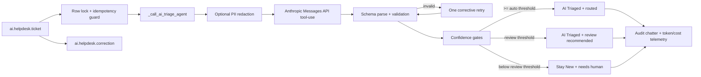

# AI Helpdesk Triage Agent

`ai_helpdesk_triage` is an Odoo 19 addon that adds a human-reviewed AI triage step to support tickets. Anthropic Claude performs the first pass: category, priority, team routing, draft reply, reasoning, confidence, token usage, and estimated cost. Humans keep control of every operational step after triage.

## Workflow

```text
New --[AI Triage]--> AI Triaged --[Assign]--> Assigned --[Start Progress]-->
In Progress --[Resolve]--> Resolved --[Close]--> Closed
```

Low-confidence triage stays in `New` with a visible "Needs human triage" banner. The AI never assigns a human, sends a reply, resolves, or closes a ticket.

## Architecture



## Models

- `ai.helpdesk.ticket`: ticket workflow, AI result fields, token/cost telemetry, original AI labels, and correction logging hooks.
- `ai.helpdesk.team`: active routing targets. The AI can only suggest existing active teams.
- `ai.helpdesk.correction`: labeled examples captured when a human overrides AI category, priority, or team.
- `res.config.settings`: Anthropic API key, confidence thresholds, daily budget, PII redaction, and spend summaries.

## Installation

From this repo root:

```powershell
.\venv\Scripts\python.exe odoo-bin -d ai_helpdesk_dev --stop-after-init -i ai_helpdesk_triage --addons-path=addons,server/odoo/Workshop
```

Or run the Docker stack:

```bash
make up
```

Then open Odoo, install **AI Helpdesk Triage Agent**, and grant users the **AI Helpdesk / User** or **AI Helpdesk / Manager** group.

## Configuration

Open **AI Helpdesk > Configuration > Settings** and set:

- **Anthropic API Key**: stored in `ir.config_parameter` as `ai_helpdesk_triage.anthropic_api_key`.
- **Auto-route Confidence Threshold**: default `0.85`; moves `New -> AI Triaged` and routes.
- **Review Confidence Threshold**: default `0.50`; below this, ticket stays `New`.
- **Daily AI Budget (USD)**: optional guardrail; `0` disables it.
- **PII redaction**: enabled by default for obvious emails and phone-like values.

The cron **AI Helpdesk: Auto-triage new tickets** is installed inactive by default to avoid surprise API spend. Enable it only after configuring the key, teams, budget, and operating policy.

## Runtime Behavior

`action_ai_triage()` is synchronous and safe against double-clicks through a row lock plus `ai_triage_attempted` guard. The Anthropic client uses tool-use structured output with a JSON schema, request timeouts, transient-error retries with exponential backoff, validation before write, and one corrective retry if the model suggests invalid labels or a missing team.

The list view includes a bulk **AI Triage Selected Tickets** server action. The same `_call_ai_triage_agent()` path is used by manual triage, bulk triage, and the cron so it can move to a queue later without rewriting validation or telemetry.

## What Leaves the Server

When AI triage runs, Odoo sends Anthropic:

- ticket subject;
- ticket description;
- customer display name, if set;
- names of active `ai.helpdesk.team` records;
- instructions and the tool-use schema.

Odoo does **not** send the stored API key to chatter, logs, or browser views. With PII redaction enabled, obvious email addresses and phone-like values in subject, description, and customer display name are replaced with `[REDACTED_EMAIL]` and `[REDACTED_PHONE]` before the API call.

This redaction is intentionally conservative and does not guarantee full anonymization. For UAE PDPL, GDPR, or similar privacy regimes, deployers should document Anthropic as a processor/subprocessor where applicable, configure retention and regional policies with the vendor, and avoid sending sensitive ticket content without a lawful basis and internal approval.

## Evaluation

The repo ships a 60-ticket golden set at `data/eval/golden.jsonl` and a runnable harness:

```bash
python server/odoo/Workshop/ai_helpdesk_triage/scripts/evaluate.py
```

The script accepts optional model predictions via `--predictions predictions.jsonl`; without predictions it runs a deterministic offline baseline so CI/reviewers can exercise the metrics path without API credentials.

Current offline baseline results saved in `docs/eval/metrics.json`:

- Classification accuracy: 90.00%
- Routing accuracy: 90.00%
- Priority accuracy: 60.00%

The calibration chart is saved to `docs/eval/confidence_calibration.png`.

`matplotlib` is used only by the evaluation harness to render the calibration chart. It is not an Odoo runtime dependency.

## Tests and Tooling

```bash
make lint
make test
make eval
```

Direct Odoo test command:

```bash
python odoo-bin -d ai_helpdesk_test --stop-after-init -i ai_helpdesk_triage --test-enable --test-tags /ai_helpdesk_triage --addons-path=addons,server/odoo/Workshop
```

CI runs ruff, black check, Odoo module install/tests, and PostgreSQL-backed test execution.

## Security Model

- **AI Helpdesk / User**: read, create, and write module records; no delete.
- **AI Helpdesk / Manager**: implies User, can delete module records, and can access the Configuration menu.
- `base.user_admin` is automatically added to the Manager group.

## Human Correction Dataset

When a human changes `category`, `priority`, or `team_id` after an AI triage, the addon creates an `ai.helpdesk.correction` record containing:

- ticket snapshot;
- field changed;
- AI value;
- human value;
- confidence and reasoning;
- correcting user and timestamp.

This is the seed for a future fine-tuning/evaluation dataset and is visible through **AI Helpdesk > Configuration > AI Corrections**.

## Ethics and Limitations

The AI output is a recommendation, not a decision-maker. It may misclassify ambiguous tickets, under-prioritize rare incidents, or produce replies that need tone, policy, or legal review. Keep the default human-in-the-loop workflow intact for production use, monitor correction rates, and treat confidence as a calibration signal rather than proof of correctness.

## Future Work

- Move the synchronous Anthropic call to a queue job for high-volume deployments.
- Add per-team routing policies and business-hours-aware priority escalation.
- Export correction rows back into `data/eval/` after human review.
- Add provider abstraction for Azure/OpenAI, Bedrock, or on-prem models.

## How to Contribute

Teammates should pick one packet from `docs/tasks/` after Mohammad shares the repo link. Each packet is a self-contained feature and should be done from the contributor's own machine and GitHub identity.

```bash
git pull
# ...make the small edits described in your packet...
ruff check .            # and run the module tests
git -c user.name="<Your Name>" \
    -c user.email="<your GitHub no-reply email>" \
    commit -m "feat(...): <your packet step>"
git push
```

If an install breaks after your change, revert your last commit, rerun the tests, and ask for review with the failing output.
