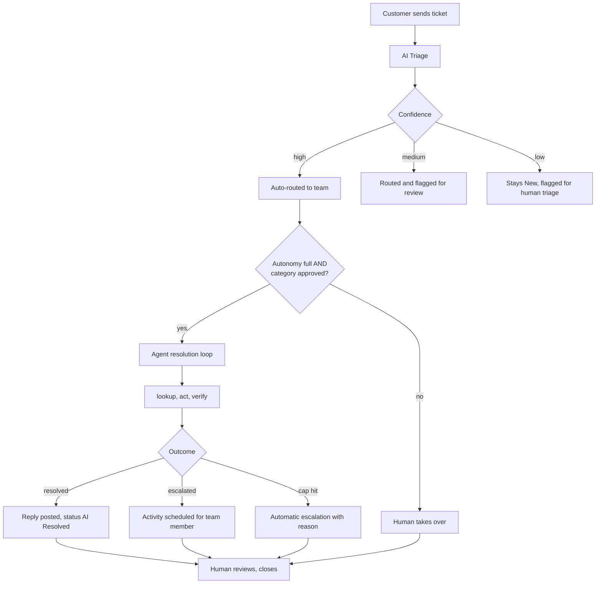

# AI Helpdesk Triage

**An Odoo 19 addon that turns Claude into a first-line support agent — with guardrails, an audit trail, and a hard spend cap.**

[](https://github.com/MohammadThabetHassan/odoo-ai-helpdesk-triage/actions/workflows/ci.yml)
[](LICENSE)
[](https://www.odoo.com)
[](https://www.python.org)

---

## What it does

Every ticket arrives, and the addon does three things:

1. **Reads the ticket.** A Claude model classifies it (category, priority, team, draft reply, reasoning, confidence).
2. **Routes it.** High-confidence tickets are moved to *AI Triaged* and assigned to a team automatically. Low-confidence ones stay in *New* with a visible flag.
3. **Optionally resolves it.** On approved categories, the agent runs a multi-turn tool-use loop against real Odoo APIs — customer lookup, invoice status, password reset, invoice resend, chatter reply, and team-activity handoff — inside a sandboxed budget and action cap.

Humans keep the final say on every state transition. The AI never closes a ticket by itself.

---

## Key features

| | |
|---|---|
| **Two-stage AI** | Triage always runs; an optional agentic resolution loop follows when confidence and category allow. |
| **Provider agnostic** | Point it at direct Anthropic or Amazon Bedrock from a single dropdown. |
| **Tightly gated autonomy** | Off, read-only, or full — with a per-category allowlist that a manager must set. |
| **Real Odoo tool use** | Look up partners, resend invoice PDFs, send password resets, post chatter replies, schedule team activities, escalate to humans. |
| **Full audit trail** | Every tool call becomes an `ai.helpdesk.action` row with input, output, success flag, and duration. |
| **Spend guardrails** | Per-ticket cost cap and per-day USD budget, both enforced mid-loop. |
| **PII redaction** | Emails and phone-like values are stripped from prompts before they leave Odoo. |
| **Human overrides captured** | Every human correction of an AI decision seeds the `ai.helpdesk.correction` dataset. |
| **CI-verified** | Every push runs lint, an evaluation harness, and the full test suite against Odoo 19 + Postgres 16. |

---

## The end-to-end flow



---

## Quick start

**Prereqs:** Odoo 19 source checkout, Python 3.11+, PostgreSQL, and an Anthropic or AWS Bedrock API key.

```bash
# 1. Point Odoo at this repo's addon subfolder
git clone https://github.com/MohammadThabetHassan/odoo-ai-helpdesk-triage.git
python odoo-bin --addons-path=/path/to/odoo/addons,./ \
                -d ai_helpdesk_dev -i ai_helpdesk_triage --stop-after-init

# 2. Boot the server
python odoo-bin -c odoo.conf

# 3. Configure
# UI -> AI Helpdesk -> Configuration -> Settings
#   - LLM Provider: Anthropic or Bedrock
#   - API Key: your key (stored in ir.config_parameter only)
#   - Autonomy: read_only to start, full when you're ready
```

Then grant users the **AI Helpdesk / User** or **AI Helpdesk / Manager** group and open **AI Helpdesk → Tickets** to create your first one.

---

## Guardrails at a glance

- **Autonomy level** — `off`, `read_only`, or `full`. Default is `read_only`.
- **Approved categories** — a comma-separated allowlist. Full autonomy on unlisted categories raises before any HTTP call.
- **Max actions per ticket** — hard cap on tool calls per resolution attempt (default 5).
- **Cost cap per ticket** — the loop terminates mid-flight on breach with `reason=cost_cap`.
- **Daily USD budget** — combined cap across triage and resolution.
- **Duplicate call blocker** — the loop hashes `(tool_name, input)` and refuses to re-execute an identical call.
- **PII redaction** — subject, description, and customer display name are scrubbed before the API call (toggle-able).
- **Human override always wins** — every AI field is human-editable; the override goes into the correction dataset.

---

## Models installed

- `ai.helpdesk.ticket` — ticket workflow, AI results, telemetry, correction hooks.
- `ai.helpdesk.team` — active routing targets. The AI can only suggest existing active teams.
- `ai.helpdesk.correction` — human-override snapshots for future model tuning.
- `ai.helpdesk.action` — audit row per tool call in the resolution loop.
- `res.config.settings` — provider selection, credentials, thresholds, budget, autonomy controls.

---

## Contributor packets

Six self-contained feature packets live under `ai_helpdesk_triage/docs/tasks/`. Each has scope, deliverables, acceptance criteria, and explicit out-of-scope items.

| Packet | Scope |
|---|---|
| A — Ticket tags | New `ai.helpdesk.tag` model with M2M to tickets + security rows. |
| B — Customer satisfaction | Selection field on resolved tickets, plus filter + group-by. |
| C — SLA deadline | Deadline field with overdue detection, list highlight, kanban badge. |
| D — Domain reputation tool | New read-class tool exposed to the agent registry. |
| E — Manager action retry | Retry button on failed `ai.helpdesk.action` rows. |
| F — Resolution latency report | Timestamped fields + pivot/graph report grouped by category. |

Pick a packet, work from your own branch, ship your PR. Nothing in a packet touches the core agent loop.

---

## Documentation

- [`ai_helpdesk_triage/README.md`](ai_helpdesk_triage/README.md) — full module reference: architecture, config parameters, workflow, security model, ethics.
- [`ai_helpdesk_triage/docs/showcase.md`](ai_helpdesk_triage/docs/showcase.md) — business-oriented narrative with scenarios and ROI framing.
- [`ai_helpdesk_triage/docs/demo-script.md`](ai_helpdesk_triage/docs/demo-script.md) — a click-by-click live demo script.
- [`ai_helpdesk_triage/docs/tasks/`](ai_helpdesk_triage/docs/tasks/) — contributor task packets.

---

## Tests and CI

```bash
make lint     # ruff + black
make test     # Odoo module test suite
make eval     # golden-set evaluation harness
```

Every push triggers GitHub Actions to install Odoo 19 + Postgres 16 from scratch, install this addon, and run the same three commands. The badge at the top of this README reflects the latest run on `main`.

Current test suite: **22 tests, 0 failed, 0 errors.**

---

## Runtime privacy

When the AI runs, Odoo sends the provider only:

- Ticket subject
- Ticket description
- Customer display name (if set)
- Names of active `ai.helpdesk.team` records
- Instructions and the tool schemas

Nothing else — no tenant data, no chatter history, no credentials — leaves the server. With PII redaction on (default), emails and phone-like values in the ticket are replaced with `[REDACTED_EMAIL]` and `[REDACTED_PHONE]` first. For GDPR / UAE PDPL contexts, deployers should still document the provider as a subprocessor and apply their own retention policy.

---

## Roadmap

- Move the synchronous provider call to a queue job for high-volume deployments.
- Add per-team routing policies and business-hours-aware priority escalation.
- Export the correction dataset for supervised fine-tuning.
- Widen the toolkit (see packets D-F).

---

## License

LGPL-3.0. See [`LICENSE`](LICENSE).
