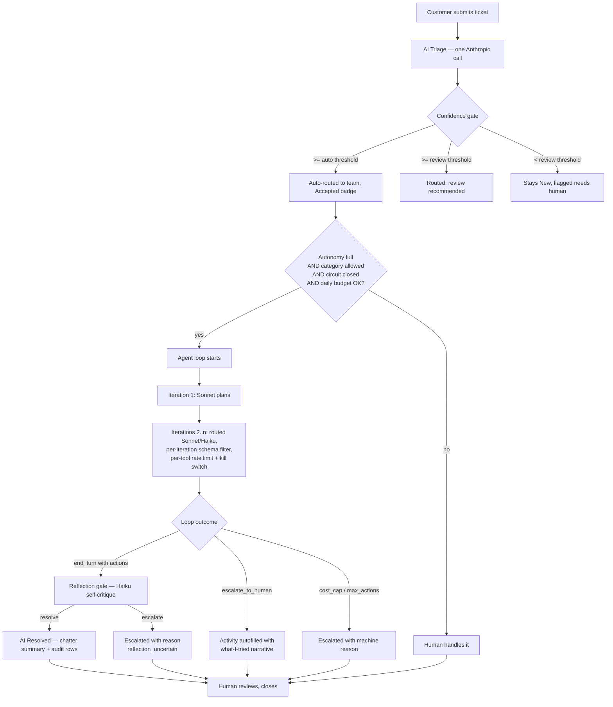

# AI Helpdesk Triage

**An Odoo 19 addon that turns Anthropic's Claude into a first-line support agent — with an audit trail per tool call, layered safety gates, live iteration streaming to the chatter, self-critique before every declared resolution, and a hard spend cap.**

[](https://github.com/MohammadThabetHassan/odoo-ai-helpdesk-triage/actions/workflows/ci.yml)
[](LICENSE)
[](https://www.odoo.com)
[](https://www.python.org)
[](#tests-and-ci)

---

## What it does

Every ticket arrives, and the addon does three things:

1. **Reads the ticket.** A Claude model classifies it (category, priority, team, draft reply, reasoning, confidence, sentiment, urgency, ambiguity).
2. **Routes it.** High-confidence tickets are moved to *AI Triaged* and assigned to a team automatically. Low-confidence ones stay in *New* with a visible flag.
3. **Optionally resolves it.** On approved categories, the agent runs a multi-turn tool-use loop against real Odoo APIs — customer lookup, invoice status, password reset, invoice resend, chatter reply, contact-info update, similar-ticket retrieval, domain-reputation lookup, and team-activity handoff — inside a sandboxed cost cap, per-tool rate limit, per-category circuit breaker, and reflection self-critique that can reverse a shaky resolution before it ships.

Humans keep the final say on every state transition. The AI never closes a ticket by itself.

---

## Feature matrix

### Loop intelligence
| | |
|---|---|
| **Prompt caching** | System prompt + tool schemas cached at Anthropic's 10 % read tariff. Second turn on the same conversation drops cost by ~90 %. |
| **Multi-model routing** | Sonnet plans the first turn and handles every write. Haiku takes over from turn 3+ when the loop has done two reads without a write, with only the read/escalation schemas visible so it structurally cannot fire a write it might mis-parameterize. |
| **Extended thinking** | Ambiguous-first-turn tickets get Anthropic's `thinking` block with a 4000-token reasoning budget before the first tool call. |
| **Reflection gate** | Before returning `resolved`, a gated Haiku self-critique inspects the last write; if it recommends `escalate`, the outcome is rewritten from resolved to escalated with `reason=reflection_uncertain`. Gates: VIP urgency, ≥3 actions, spend > 50 % of the cap, or (full autonomy + last action was a write). |
| **Bedrock model pinning** | On AWS Bedrock the model is baked into the URL, so mid-loop routing would silently no-op. The loop pins Sonnet up front on Bedrock so cost accounting stays honest. |

### Tool surface (11 tools)
| Class | Tool | Purpose |
|---|---|---|
| read | `lookup_customer` | Partner lookup by email |
| read | `lookup_invoice` | Invoice status by reference (requires `account`) |
| read | `list_customer_recent_activity` | Recent ticket history for a partner |
| read | `find_similar_tickets` | Postgres FTS over past *resolved* tickets — returns subject, category, and the tool sequence that worked, as few-shot context |
| read | `check_domain_reputation` | Trusted / suspicious / unknown verdict on an email domain; matches subdomain suffixes so throwaway-mail subdomains cannot slip through |
| write | `send_password_reset` | Odoo `auth_signup` reset flow |
| write | `resend_invoice_pdf` | Regenerate + email an invoice PDF (requires `account`) |
| write | `post_customer_reply` | Customer-facing chatter reply with a partner-lookup fallback |
| write | `update_customer_contact` | Change partner email/phone. Guarded: new value must appear verbatim in ticket text, cannot be a redacted placeholder, cannot land on the reputation denylist. Hidden entirely when `redact_pii` is on. |
| escalation | `create_team_activity` | Schedule a to-do on the ticket for a specialist team |
| escalation | `escalate_to_human` | Terminal signal — loop ends escalated |

### Safety and governance
| | |
|---|---|
| **Autonomy tiers** | `off` / `read_only` / `full`. Full also requires a per-category allowlist. |
| **Per-tool kill switch** | Comma-separated `disabled_tools` config parameter removes tools from the schema. |
| **Defense-in-depth** | The loop refuses to execute any tool name that was not in the schema for this iteration — a hallucinated call to a disabled or turn-scoped-out tool is rejected before the callable runs. |
| **Per-category circuit breaker** | Refuses `AI Resolve` when the recent action log for the ticket's category shows too high a failure ratio. Pre-execution policy refusals (rate-limited, duplicate, denylisted, kill-switched, JSON validation) are excluded from the health signal, so a noisy customer cannot trip the breaker for their category. |
| **Per-tool per-customer rate limits** | JSON config: `{tool: {window_s, max_calls}}`. Anonymous tickets are never rate-limited. |
| **Daily USD budget** | Combined cap across triage AND resolution spend. |
| **Per-ticket cost cap** | Loop terminates mid-flight on breach with `reason=cost_cap`. |
| **Max actions per ticket** | Hard iteration ceiling (default 5). |
| **Duplicate-call blocker** | Hashes `(tool_name, input)` per loop. |
| **PII redaction** | Emails and phone-like values scrubbed from ticket subject, description, and customer display before every API call. Tools that need the raw values (`update_customer_contact`) are hidden from the schema when redaction is on. |
| **ATO defense on contact updates** | Value must appear in ticket text; redacted placeholders rejected; email domain must not be on the denylist (matched with subdomain suffixes). |
| **Human override always wins** | Every AI field is human-editable; the override goes into `ai.helpdesk.correction`. |

### Visibility and analytics
| | |
|---|---|
| **Per-iteration chatter streaming** | Each loop iteration posts an internal note to the ticket chatter with the model badge (Sonnet / Haiku), assistant text, and the tool calls with their inputs. Posted before the tools execute so the reasoning is visible even if a tool later crashes. |
| **Escalation activity autofill** | On `escalate_to_human` a to-do activity is scheduled on the ticket with a numbered *what-I-tried* narrative built from the action log plus the AI's closing recommendation. |
| **AI Actions pivot + graph** | Success rate and cost per tool, filterable by category / ticket / date. |
| **AI Resolution Report** | Pivot + graph over resolved tickets grouped by category with average resolution duration. The duration compute stores `False` on unresolved tickets so the average is not dragged toward zero. |
| **AI Corrections dashboard** | Every human override of an AI decision is a row with the before/after values, the reasoning, and the correcting user — the seed for fine-tuning. |
| **Ticket satisfaction** | Happy / Neutral / Unhappy selection appearing on resolved tickets, filterable and groupable in the search UI. |

---

## The end-to-end flow



---

## Quick start

**Prereqs:** Odoo 19 source checkout, Python 3.11+, PostgreSQL 16+, and an Anthropic or AWS Bedrock API key.

```bash
# 1. Point Odoo at this repo's addon subfolder
git clone https://github.com/MohammadThabetHassan/odoo-ai-helpdesk-triage.git
python odoo-bin --addons-path=/path/to/odoo/addons,./odoo-ai-helpdesk-triage \
                -d ai_helpdesk_dev -i ai_helpdesk_triage --stop-after-init

# 2. Boot the server
python odoo-bin -c odoo.conf

# 3. Configure
# UI -> AI Helpdesk -> Configuration -> Settings
#   - LLM Provider: Anthropic (direct) or Bedrock
#   - API Key: your key (stored in ir.config_parameter only)
#   - Autonomy Level: read_only to start, full when you're ready
#   - Categories approved for full autonomy: e.g. billing,technical
```

Grant users the **AI Helpdesk / User** or **AI Helpdesk / Manager** group and open **AI Helpdesk → Tickets** to create your first ticket.

---

## Configuration reference

**AI Helpdesk → Configuration → Settings**

| Setting | Purpose | Default |
|---|---|---|
| LLM Provider | Anthropic direct or Amazon Bedrock | Anthropic |
| API Key | Provider credential | (unset) |
| PII redaction | Scrub emails/phone-like values before API call — also hides `update_customer_contact` from the schema | On |
| Auto-route Confidence Threshold | At or above this, ticket auto-routes to *AI Triaged* | 0.85 |
| Review Confidence Threshold | Below this, ticket stays *New* with review flag | 0.50 |
| Daily AI Budget (USD) | Combined cap across triage + resolution | 0 (disabled) |
| Autonomy Level | `off` / `read_only` / `full` | `read_only` |
| Categories approved for full autonomy | Comma-separated allowlist | (empty) |
| Max actions per ticket | Iteration ceiling | 5 |
| Cost cap per ticket (USD) | Mid-loop escalation trigger | 0.50 |
| Auto-run resolution after triage | Fires resolve loop when confidence gates pass | Off |
| Disabled tools (kill switch) | Comma-separated tool names to hide from the model | (empty) |
| Circuit breaker window (s) | Lookback for the category failure ratio | 3600 |
| Circuit breaker failure threshold | Ratio of failed to total actions that trips the breaker | 0.70 |
| Circuit breaker min actions | Minimum sample size before the breaker can trip | 5 |
| Tool rate limits (JSON) | `{"tool_name": {"window_s": 3600, "max_calls": 5}}` | (empty) |

**Bedrock extras** (visible when provider is Bedrock):

| Setting | Purpose |
|---|---|
| Bedrock API Key | Long-lived API key, used as a Bearer token |
| Bedrock Region | AWS region for the runtime endpoint (default `us-east-1`) |
| Bedrock Model ID | Full Claude model identifier |

The cron **AI Helpdesk: Auto-triage new tickets** is installed inactive by default to avoid surprise API spend.

---

## Models installed

| Model | Role |
|---|---|
| `ai.helpdesk.ticket` | Ticket workflow, AI triage results, sentiment/urgency/ambiguity, telemetry, resolution status, satisfaction. |
| `ai.helpdesk.team` | Active routing targets — the AI can only suggest existing active teams. |
| `ai.helpdesk.action` | Structured audit row per tool call: tool name, JSON input, JSON output, success flag, error message, cost, duration, model, tokens. |
| `ai.helpdesk.correction` | Human-override snapshots — the fine-tuning dataset seed. |
| `res.config.settings` | Provider selection, credentials, thresholds, budget, autonomy controls, safety knobs. |

---

## Runtime privacy

When the AI runs, Odoo sends the provider only:

- Ticket subject (redacted if `redact_pii` is on)
- Ticket description (redacted if `redact_pii` is on)
- Customer display name (redacted if `redact_pii` is on)
- Names of active `ai.helpdesk.team` records
- Instructions and the tool schemas

Nothing else — no tenant data, no chatter history, no credentials — leaves the server. With PII redaction on (default), obvious emails and phone-like values in the ticket are replaced with `[REDACTED_EMAIL]` and `[REDACTED_PHONE]` before the call. Tools that need the raw values (`update_customer_contact`) are hidden from the schema entirely under redaction, so the model cannot be asked for a value it never saw.

The reflection gate re-reads the conversation and shares the same redaction guarantees. For GDPR / UAE PDPL contexts, deployers should still document the provider as a subprocessor, configure retention with the vendor, and avoid sending sensitive ticket content without a lawful basis.

---

## Documentation

- [`ai_helpdesk_triage/README.md`](ai_helpdesk_triage/README.md) — Full module technical reference: architecture, config parameters, workflow, security model, ethics.
- [`ai_helpdesk_triage/docs/showcase.md`](ai_helpdesk_triage/docs/showcase.md) — Business narrative with scenarios and ROI framing.
- [`ai_helpdesk_triage/docs/demo-script.md`](ai_helpdesk_triage/docs/demo-script.md) — Five copy-pasteable live demo scenarios that collectively exercise every tool and every guardrail in ~10 minutes on stage.
- [`ai_helpdesk_triage/docs/tasks/`](ai_helpdesk_triage/docs/tasks/) — Contributor task packets.

---

## Tests and CI

```bash
make lint     # ruff + black
make test     # Odoo module test suite
make eval     # golden-set evaluation harness
```

Every push triggers GitHub Actions to install Odoo 19 + Postgres 16 from scratch, install this addon, and run the same three commands. The badge at the top of this README reflects the latest run on `main`.

**Current test suite: 96 tests, 0 failed, 0 errors.** Coverage spans:
- Structured triage output parsing (validation, retry, fenced-JSON fallback)
- Workflow state machine + idempotency + human overrides
- Security groups + ACL
- Multi-tool agent journeys (autonomous fix, VIP escalation, retrieval, denials)
- Loop decision helpers (`_choose_iteration_model`, `_should_reflect`)
- Circuit breaker false-open regression
- Rate limit + kill switch + defense-in-depth
- Retrieval PII redaction and reflection-check filter
- ATO guard, denylist subdomain matching, redacted-placeholder rejection
- Bedrock model pinning
- Extended thinking payload assembly

---

## Contributor packets

Six self-contained feature packets live under `ai_helpdesk_triage/docs/tasks/`. Packet status:

| Packet | Scope | Status |
|---|---|---|
| A — Ticket tags | New `ai.helpdesk.tag` model + M2M | Planned |
| B — Customer satisfaction | Selection field on resolved tickets | **Shipped** |
| C — SLA deadline | Deadline field + overdue detection | Planned |
| D — Domain reputation tool | Read-class tool in the agent registry | **Shipped** |
| E — Manager action retry | Retry button on failed action rows | Planned |
| F — Resolution latency report | Pivot/graph grouped by category | **Shipped** |

Pick a packet, open a PR against `main`. Every PR requires at least one review; direct pushes to `main` are blocked.

---

## Roadmap

- Split `models/helpdesk_ticket.py` into `models/mixins/{triage,resolve,guards,corrections}.py` for readability.
- Add a real-API CI smoke test against a sandbox provider with a $0.10 daily cap.
- Move the synchronous provider call to a queue job for high-volume deployments.
- Add per-team routing policies and business-hours-aware priority escalation.
- Ship a mail-gateway anti-spoofing check as the primary ATO defense in front of `update_customer_contact` (the in-tool guard is layered defense).
- Export the correction dataset for supervised fine-tuning.

---

## License

LGPL-3.0. See [`LICENSE`](LICENSE).
