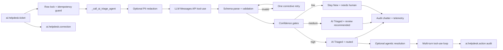

# AI Helpdesk Triage Agent

An Odoo 19 addon that adds a human-reviewed AI triage step to support tickets, plus an optional autonomous resolution loop. A Claude model classifies the ticket, routes it to a team, drafts a reply, and — on approved categories — calls real Odoo APIs to resolve the ticket end-to-end.

Humans keep control of every operational step. The AI never closes a ticket by itself.

---

## Two stages, two guardrail sets

### Stage 1 — Triage (always on)

One structured Anthropic tool call returns category, priority, suggested team, draft reply, reasoning, and confidence. The result is validated against a JSON schema. If the model returns an invalid payload, one corrective retry runs before falling back to a safe default.

```text
New --[AI Triage]--> AI Triaged --[Assign]--> Assigned --[Start]-->
In Progress --[Resolve]--> Resolved --[Close]--> Closed
```

Low-confidence triage stays in `New` with a visible "Needs human triage" banner.

### Stage 2 — Agentic resolution (opt-in per category)

After triage, the agent can enter a multi-turn tool-use loop and take action:

- Read tools: `lookup_customer`, `lookup_invoice`, `list_customer_recent_activity`
- Write tools: `resend_invoice_pdf`, `send_password_reset`, `post_customer_reply`
- Escalation tools: `create_team_activity`, `escalate_to_human`

Each tool call runs inside a savepoint, is hashed to block duplicates, and is persisted to `ai.helpdesk.action`. The loop terminates when the AI ends its turn, explicitly escalates, hits `max_actions_per_ticket`, or exceeds `action_cost_cap_usd`.

---

## Architecture



---

## Installation

```bash
# From the repo root
python odoo-bin --addons-path=/path/to/odoo/addons,./ \
                -d ai_helpdesk_dev -i ai_helpdesk_triage --stop-after-init

# Or via the Docker stack
make up
```

Then grant users the **AI Helpdesk / User** or **AI Helpdesk / Manager** group.

---

## Configuration

**AI Helpdesk → Configuration → Settings**

| Setting | Purpose | Default |
|---|---|---|
| LLM Provider | Anthropic direct or Amazon Bedrock | Anthropic |
| API Key | Provider credential (stored in `ir.config_parameter`) | (unset) |
| Auto-route Confidence Threshold | Above this, ticket auto-routes to *AI Triaged* | 0.85 |
| Review Confidence Threshold | Below this, ticket stays *New* with review flag | 0.50 |
| Daily AI Budget (USD) | Combined spend cap across triage + resolution | 0 (disabled) |
| PII redaction | Strip emails/phone-like values before API call | On |
| AI Autonomy Level | `off` / `read_only` / `full` | `read_only` |
| Categories approved for full autonomy | Comma-separated allowlist | (empty) |
| Max actions per ticket | Hard cap on tool calls per resolution attempt | 5 |
| Cost cap per ticket (USD) | Mid-loop escalation trigger | 0.50 |
| Auto-run resolution after triage | Kick off resolve loop on high-confidence tickets | Off |

**Bedrock extras** (visible when provider is Bedrock):

| Setting | Purpose |
|---|---|
| Bedrock API Key | Long-lived API key, used as a Bearer token |
| Bedrock Region | AWS region for the runtime endpoint (default `us-east-1`) |
| Bedrock Model ID | Full Claude model identifier |

The cron **AI Helpdesk: Auto-triage new tickets** is installed inactive by default to avoid surprise API spend.

---

## Models

| Model | Role |
|---|---|
| `ai.helpdesk.ticket` | Ticket workflow, AI results, telemetry, correction hooks, resolution status. |
| `ai.helpdesk.team` | Active routing targets. The AI can only suggest existing active teams. |
| `ai.helpdesk.correction` | Human-override snapshots for future model tuning. |
| `ai.helpdesk.action` | Audit row per tool call in the resolution loop. |
| `res.config.settings` | Provider selection, credentials, thresholds, budget, autonomy controls. |

---

## What leaves the server

When AI triage or resolution runs, Odoo sends the provider:

- Ticket subject
- Ticket description
- Customer display name, if set
- Names of active `ai.helpdesk.team` records
- Instructions and the tool schemas

Odoo does **not** send the stored API key to chatter, logs, or the browser. With PII redaction on (default), obvious emails and phone-like values in subject, description, and customer display name are replaced with `[REDACTED_EMAIL]` and `[REDACTED_PHONE]` first.

This redaction is intentionally conservative and does not guarantee full anonymization. For UAE PDPL, GDPR, or similar regimes, deployers should document the LLM provider as a subprocessor where applicable, configure retention and regional policies with the vendor, and avoid sending sensitive ticket content without a lawful basis.

---

## Evaluation

A 60-ticket golden set lives at `data/eval/golden.jsonl` and a runnable harness:

```bash
python scripts/evaluate.py
```

The script accepts optional model predictions via `--predictions predictions.jsonl`; without predictions it runs a deterministic offline baseline so CI and reviewers can exercise the metrics path without API credentials.

Current offline baseline (see `docs/eval/metrics.json`):

- Classification accuracy: **90 %**
- Routing accuracy: **90 %**
- Priority accuracy: **60 %**

The calibration chart is saved to `docs/eval/confidence_calibration.png`. `matplotlib` is only used by the harness and is not an Odoo runtime dependency.

---

## Tests

```bash
# Full module test suite
python odoo-bin -c odoo.conf -d ai_helpdesk_test -u ai_helpdesk_triage \
                --test-enable --test-tags /ai_helpdesk_triage --stop-after-init

# Or via Make
make test
```

Coverage: parsing validation, workflow state machine, idempotency, security, and end-to-end agent scenarios (triage → resolution → escalation → cost cap → autonomy gating → category allowlist).

Every push triggers GitHub Actions to install Odoo 19 + Postgres 16 from scratch and run lint, evaluation, and the test suite.

---

## Security model

- **AI Helpdesk / User** — read, create, and write module records; no delete.
- **AI Helpdesk / Manager** — implies User, can delete module records, and can access the Configuration menu.
- `base.user_admin` is added to the Manager group automatically.
- `ai.helpdesk.action` is read-only to users; managers have full write access for retry workflows.

---

## Human correction dataset

Any time a human changes `category`, `priority`, or `team_id` on an AI-triaged ticket, the addon creates an `ai.helpdesk.correction` row containing the ticket snapshot, the field changed, AI value, human value, AI reasoning, and the correcting user + timestamp.

This is the seed for a future fine-tuning / evaluation dataset. Visible under **AI Helpdesk → Configuration → AI Corrections** as a list, a pivot, and a bar chart by field.

---

## Ethics and limitations

The AI output is a recommendation, not a decision-maker. It may misclassify ambiguous tickets, under-prioritize rare incidents, or produce replies that need tone, policy, or legal review. Keep the default human-in-the-loop workflow intact for production use, monitor correction rates, and treat confidence as a calibration signal — not proof of correctness.

The agentic resolution loop is deliberately narrow. It can only call the tools registered in `models/tool_registry.py`, cannot execute arbitrary code, cannot modify ticket state directly (writes go through the audited tool functions), and always runs behind the autonomy and category gates.

---

## Contributor packets

Six self-contained feature packets live under `docs/tasks/`. Each has scope, deliverables, acceptance criteria, and out-of-scope items. Pick one, work from your own branch, ship the PR.

| Packet | Scope |
|---|---|
| A — Ticket tags | New `ai.helpdesk.tag` model + M2M relation |
| B — Customer satisfaction | Selection field for resolved tickets |
| C — SLA deadline | Deadline field, overdue detection, list highlight |
| D — Domain reputation tool | New read-class tool in the agent registry |
| E — Manager action retry | Retry button on failed `ai.helpdesk.action` rows |
| F — Resolution latency report | Timestamped fields + pivot/graph report |

---

## Roadmap

- Move the synchronous provider call to a queue job for high-volume deployments.
- Add per-team routing policies and business-hours-aware priority escalation.
- Export correction rows back into `data/eval/` after human review.
- Widen the toolkit (see packets D-F).
