# AI Helpdesk Triage Agent

An Odoo 19 addon that adds a human-reviewed AI triage step to support tickets, plus an optional autonomous resolution loop with prompt caching, multi-model routing, self-critique, and layered safety gates. A Claude model classifies the ticket, routes it to a team, drafts a reply, and — on approved categories — calls real Odoo APIs to resolve the ticket end-to-end.

Humans keep control of every operational step. The AI never closes a ticket by itself.

---

## Two stages, two guardrail sets

### Stage 1 — Triage (always on)

One structured Anthropic tool call returns eight normalized fields:

| Field | Purpose |
|---|---|
| `category` | technical / billing / general / feature_request |
| `priority` | 0 low / 1 medium / 2 high / 3 urgent |
| `suggested_team` | Must match an existing active `ai.helpdesk.team` name |
| `reasoning` | Human-readable justification |
| `suggested_reply` | Draft reply for a human to edit |
| `confidence` | 0.0–1.0 |
| `sentiment` | neutral / frustrated / angry |
| `urgency` | low / normal / vip |
| `is_ambiguous` | true when the ticket does not describe one clear action |

The payload is validated against a JSON schema. On an invalid tool input, one corrective retry runs with the previous errors and the invalid payload appended to the prompt. If the retry still fails validation, the module falls back to a safe result (category=general, low confidence, needs_human) and the ticket stays in `New` for human triage.

```text
New --[AI Triage]--> AI Triaged --[Assign]--> Assigned --[Start]-->
In Progress --[Resolve]--> Resolved --[Close]--> Closed
```

Low-confidence triage stays in `New` with a visible "Needs human triage" banner.

### Stage 2 — Agentic resolution (opt-in per category)

After triage, the agent can enter a multi-turn tool-use loop:

- **Read tools**: `lookup_customer`, `lookup_invoice`, `list_customer_recent_activity`, `find_similar_tickets`, `check_domain_reputation`
- **Write tools**: `send_password_reset`, `resend_invoice_pdf`, `post_customer_reply`, `update_customer_contact`
- **Escalation tools**: `create_team_activity`, `escalate_to_human`

Each tool call runs inside a savepoint, is hashed to block duplicates, is rate-limited per (tool, customer), goes through the schema defense-in-depth check, and is persisted to `ai.helpdesk.action`. The loop terminates when the AI ends its turn, explicitly escalates, hits `max_actions_per_ticket`, exceeds `action_cost_cap_usd`, or gets reversed by the reflection gate.

---

## Loop intelligence layer

### Prompt caching

The system prompt and the tool schemas ship as `cache_control: {type: ephemeral}` blocks. Second and later iterations of the same conversation read the tokenized prefix from Anthropic's cache at 10 % of the input rate; the first iteration pays 125 % of the input rate to write the cache. On Bedrock regions that do not surface cache token counts, the loop treats missing fields as zero — the extra cost falls away.

### Multi-model routing

`_choose_iteration_model` picks Sonnet or Haiku per iteration:

- Iteration 1 always Sonnet (planning).
- Any iteration where a write is imminent, VIP urgency, or the triage flagged the ticket ambiguous: Sonnet.
- Once the loop has done ≥2 reads without any write: Haiku takes over, and it is only given the read/escalation tool schemas so it structurally cannot fire a write.
- A single `bad_arguments` outcome on a Haiku turn flips a sticky Sonnet flag for the rest of the loop.
- On AWS Bedrock the sticky Sonnet flag is set up front — Bedrock bakes the model into the URL and drops `payload["model"]`, so mid-loop routing would silently no-op and pretend Haiku savings that never happen.

### Extended thinking

When the triage step flagged `is_ambiguous=true` AND the first iteration is on Sonnet (direct Anthropic), the payload carries `thinking: {type: enabled, budget_tokens: 4000}`. The completion budget (`max_tokens`) is raised by the thinking budget so the API's `budget_tokens < max_tokens` constraint is respected.

### Reflection gate

Before returning `status=resolved`, the loop runs one gated self-critique. Gate condition (any of):

- Last action was a `write` class AND autonomy is `full`
- Ticket urgency is `vip`
- Actions count ≥ 3
- Total cost > 50 % of the per-ticket cost cap

The reflection call uses Haiku (or Sonnet on Bedrock, for pricing honesty), a `reflect` tool schema with `{did_solve, reason, recommend}` output, and produces one audit row (`tool_name=reflection_check`). If `recommend=escalate`, the outcome is rewritten to `escalated` with `reason=reflection_uncertain`. Reflection failures are swallowed and logged so a broken auditor can never block a good resolution.

---

## Safety layers

| Layer | Enforcement site | Reason emitted |
|---|---|---|
| Autonomy tier | `_get_autonomy_level` | UserError before any HTTP call |
| Category allowlist | `_ensure_category_allowed_for_full_autonomy` | UserError |
| Daily USD budget | `_guard_daily_budget` — sums `ai_total_cost` + `ai_resolution_cost` since day start | UserError |
| Circuit breaker | `_check_circuit_breaker` — excludes rows carrying policy-refusal error codes | UserError |
| Kill switch | `tool_registry._get_disabled_tools` | Tool hidden from schema |
| `requires_raw_pii` gate | `tool_registry.get_available_tools` when `redact_pii` is on | Tool hidden from schema |
| Per-tool rate limit | `agent_loop._rate_limit_exceeded` | `{ok:false, error:rate_limited}` action row |
| Duplicate call blocker | `agent_loop.run` hashes `(name, input)` | `{ok:false, error:duplicate_call_blocked}` action row |
| Iteration schema defense-in-depth | `allowed_names` computed per iteration | `{ok:false, error:tool_not_in_iteration_schema}` action row |
| Cost cap | `agent_loop.run` after each iteration | Loop terminates with `reason=cost_cap` |
| Max actions | `agent_loop.run` loop counter | Loop terminates with `reason=max_actions` |
| PII redaction | `_redact_pii` + `_get_bool_param("ai_helpdesk_triage.redact_pii")` | Values in outbound prompt replaced with `[REDACTED_EMAIL]` / `[REDACTED_PHONE]` |
| ATO guard on contact update | `update_customer_contact` | `{ok:false, error:value_not_in_ticket_text}` or `denylisted_email_domain` or `redacted_placeholder_rejected` |
| Reflection reversal | `_finalize_with_reflection` | Outcome rewritten to `escalated` / `reflection_uncertain` |

The `PRE_EXECUTION_REFUSAL_ERRORS` tuple in `helpdesk_ticket.py` lists every error code that the circuit breaker must exclude from its health signal — any consumer that treats action rows as a downstream-failure indicator (breaker, future anomaly cron) reads the same source of truth.

---

## Architecture

```mermaid
flowchart LR
    Ticket[ai.helpdesk.ticket] --> Lock[Row lock + idempotency guard]
    Lock --> Triage[_call_ai_triage_agent]
    Triage --> Redact[Optional PII redaction]
    Redact --> LLM1[LLM triage tool-use]
    LLM1 --> Validate[Schema parse + validation]
    Validate -->|invalid| Retry[One corrective retry]
    Retry --> Validate
    Validate --> Gate[Confidence gates]
    Gate -->|high| Triaged[AI Triaged + routed + sentiment/urgency stored]
    Gate -->|medium| Review[Routed + review recommended]
    Gate -->|low| Human[Stays New + needs_human]

    Triaged --> Resolve[Optional agentic resolution]
    Resolve --> Preflight[_guard_daily_budget<br/>_check_circuit_breaker<br/>_ensure_category_allowed]
    Preflight --> Loop[Multi-turn agent_loop.run]
    Loop --> Router[_choose_iteration_model<br/>_filter_schemas_by_class]
    Router --> Payload[_build_payload<br/>with cache_control + thinking]
    Payload --> LLM2[LLM iteration call]
    LLM2 --> Cost[Cost accounting<br/>input, output, cache_read, cache_write]
    Cost --> Stream[_post_agent_iteration_note]
    Stream --> Execute[_execute_tool<br/>rate limit + savepoint + defense-in-depth]
    Execute --> Record[_record_action - monotonic sequence]
    Record --> Next{stop_reason<br/>terminal_hit<br/>cost_cap}
    Next -->|continue| Router
    Next -->|end_turn with actions| Reflect[_finalize_with_reflection]
    Reflect -->|resolve| Resolved[ai_resolution_status = resolved]
    Reflect -->|escalate| Escalated[ai_resolution_status = escalated<br/>reason = reflection_uncertain]
    Next -->|escalate_to_human| Activity[_schedule_escalation_activity]
    Ticket --> Corrections[ai.helpdesk.correction on human overrides]
```



---

## Installation

```bash
# From the repo root
python odoo-bin --addons-path=/path/to/odoo/addons,./ \
                -d ai_helpdesk_dev -i ai_helpdesk_triage --stop-after-init

# Or via the Docker stack
make up
```

Then grant users the **AI Helpdesk / User** or **AI Helpdesk / Manager** group.

---

## Configuration reference

**AI Helpdesk → Configuration → Settings**

### LLM Provider block

| Setting | Purpose | Default |
|---|---|---|
| LLM Provider | Anthropic direct or Amazon Bedrock | Anthropic |
| Anthropic API Key | Stored in `ir.config_parameter` | (unset) |
| Bedrock API Key | Long-lived Bedrock key | (unset) |
| Bedrock Region | AWS region for the runtime endpoint | `us-east-1` |
| Bedrock Model ID | Full Claude model identifier | `us.anthropic.claude-sonnet-4-5-20250929-v1:0` |
| PII redaction | Scrub emails/phone-like values from prompts; also hides `update_customer_contact` from the schema | On |

### Autonomy Guardrails block

| Setting | Purpose | Default |
|---|---|---|
| Auto-route Confidence Threshold | At or above this, ticket auto-routes to *AI Triaged* | 0.85 |
| Review Confidence Threshold | Below this, ticket stays *New* with review flag | 0.50 |
| Daily AI Budget (USD) | Combined cap across triage + resolution | 0 (disabled) |

### Agentic Resolution block

| Setting | Purpose | Default |
|---|---|---|
| Autonomy Level | `off` / `read_only` / `full` | `read_only` |
| Categories approved for full autonomy | Comma-separated allowlist | (empty) |
| Max actions per ticket | Iteration ceiling | 5 |
| Cost cap per ticket (USD) | Mid-loop escalation trigger | 0.50 |
| Auto-run resolution after triage | Fires resolve loop on high-confidence triaged tickets | Off |
| Disabled tools (kill switch) | Comma-separated tool names hidden from the model | (empty) |

### Circuit breaker knobs (not on the settings screen — set via `ir.config_parameter`)

| Key | Default |
|---|---|
| `ai_helpdesk_triage.circuit_breaker_window_seconds` | 3600 |
| `ai_helpdesk_triage.circuit_breaker_failure_threshold` | 0.7 |
| `ai_helpdesk_triage.circuit_breaker_min_actions` | 5 |
| `ai_helpdesk_triage.tool_rate_limits` | (empty JSON) |

### Spend Visibility

Two read-only fields on the settings form show today's and this month's estimated spend across both triage and resolution.

The cron **AI Helpdesk: Auto-triage new tickets** is installed inactive by default to avoid surprise API spend.

---

## Models

| Model | Role |
|---|---|
| `ai.helpdesk.ticket` | Ticket workflow, AI triage results, sentiment/urgency/ambiguity, resolution status, satisfaction. |
| `ai.helpdesk.team` | Active routing targets. The AI can only suggest existing active teams. |
| `ai.helpdesk.correction` | Human-override snapshots for future model tuning. Every human edit of `category`, `priority`, or `team_id` on an AI-triaged ticket lands here. |
| `ai.helpdesk.action` | Audit row per tool call in the resolution loop. Carries model id, tokens, cost, duration, tool input JSON, tool result JSON, and — for policy refusals — an `error_message` matching `PRE_EXECUTION_REFUSAL_ERRORS`. |
| `res.config.settings` | Provider selection, credentials, thresholds, budget, autonomy controls, safety knobs. |

---

## What leaves the server

When AI triage or resolution runs, Odoo sends the provider:

- Ticket subject (redacted if `redact_pii` is on)
- Ticket description (redacted if `redact_pii` is on)
- Customer display name if set (redacted if `redact_pii` is on)
- Resolve loop only: customer email (NOT redacted — write tools need it, but the tool that could exfiltrate it (`update_customer_contact`) is hidden under redaction)
- Resolve loop only: tool results returned to the model (for example `lookup_customer` returns the partner name, email and phone; `find_similar_tickets` results are redacted)
- Names of active `ai.helpdesk.team` records
- Instructions and the tool schemas

Odoo does **not** send the stored API key to chatter, logs, or the browser.

The reflection gate re-sends the same conversation, so it carries exactly what the loop already sent.

For UAE PDPL, GDPR, or similar regimes, deployers should document the LLM provider as a subprocessor where applicable, configure retention and regional policies with the vendor, and avoid sending sensitive ticket content without a lawful basis.

---

## Evaluation

A 60-ticket golden set lives at `data/eval/golden.jsonl` and a runnable harness:

```bash
python scripts/evaluate.py
```

The script accepts optional model predictions via `--predictions predictions.jsonl`; without predictions it runs a deterministic offline baseline so CI and reviewers can exercise the metrics path without API credentials.

Current offline baseline (see `docs/eval/metrics.json`):

- Classification accuracy: **90 %**
- Routing accuracy: **90 %**
- Priority accuracy: **60 %**

The calibration chart is saved to `docs/eval/confidence_calibration.png`. `matplotlib` is only used by the harness and is not an Odoo runtime dependency.

---

## Tests

```bash
# Full module test suite
python odoo-bin -c odoo.conf -d ai_helpdesk_test -u ai_helpdesk_triage \
                --test-enable --test-tags /ai_helpdesk_triage --stop-after-init

# Or via Make
make test
```

**Current suite: 74 tests, 0 failed.** Coverage layout:

| Test file | Coverage |
|---|---|
| `test_ai_parsing.py` | Structured triage output parsing, validation, fenced-JSON fallback, transient HTTP retries, PII redaction, daily-budget guard, low-confidence branch. |
| `test_triage_flow.py` | Workflow state machine, idempotency, human overrides producing correction rows. |
| `test_security.py` | User vs manager ACL, admin implies manager, public user has no access. |
| `test_e2e_agent_flow.py` | Multi-tool agent journeys, cost cap, reflection escalation, autonomy read-only filtering, category allowlist enforcement, circuit breaker, rate limiter. |
| `test_agent_loop_helpers.py` | Unit tests for `_choose_iteration_model` (12 cases across iteration count, sentiment, urgency, sticky_sonnet) and `_should_reflect`. |
| `test_kill_switch.py` | Kill-switch filters both `get_available_tools` and `get_tool_schemas`; `requires_raw_pii` tools hidden when redaction is on. |
| `test_update_customer_contact.py` | ATO guard: verbatim-in-ticket-text refusal, denylisted domain refusal, subdomain denylist refusal, redacted-placeholder refusal, partial update. |
| `test_retrieval_tools.py` | FTS retrieval, current-ticket exclusion, cross-customer PII redaction, `reflection_check` meta-row filter. |
| `test_reputation_tools.py` | Trusted allowlist, throwaway denylist, filtered partner scan. |
| `test_demo_scenarios.py` | End-to-end demo walks (password reset, contextual escalation, governance refusal, prompt-cache cost check, extended-thinking payload assertion, Bedrock model pinning). |

Every push to `main` triggers GitHub Actions to install Odoo 19 + Postgres 16 from scratch and run lint, evaluation, and the test suite.

---

## Security model

- **AI Helpdesk / User** — read, create, and write module records; no delete.
- **AI Helpdesk / Manager** — implies User, can delete module records, and can access the Configuration menu.
- `base.user_admin` is added to the Manager group automatically.
- `ai.helpdesk.action` is read-only to users; managers have full write access for retry workflows.
- `main` is a protected branch: every change goes through a PR with at least one approving review; force pushes and deletions are blocked.

---

## Human correction dataset

Any time a human changes `category`, `priority`, or `team_id` on an AI-triaged ticket, the addon creates an `ai.helpdesk.correction` row containing the ticket snapshot, the field changed, AI value, human value, AI reasoning, AI confidence, and the correcting user + timestamp.

Visible under **AI Helpdesk → Configuration → AI Corrections** as a list, pivot, and bar chart by field. This is the seed for a future fine-tuning / evaluation dataset.

---

## Analytics and reporting

Two dashboards ship out of the box:

- **AI Helpdesk → Configuration → AI Analytics** — pivot + graph over `ai.helpdesk.action` grouped by tool with success rate, cost, duration, and token measures. Filter by category / ticket / date.
- **AI Helpdesk → Reports** — pivot + graph over `ai.helpdesk.ticket` restricted to resolved rows, grouped by category, with average resolution duration in minutes. The duration field carries `aggregator="avg"` and stores `False` on unresolved tickets so the average is not dragged toward zero by unattempted rows.

---

## Ethics and limitations

The AI output is a recommendation, not a decision-maker. It may misclassify ambiguous tickets, under-prioritize rare incidents, or produce replies that need tone, policy, or legal review. Keep the default human-in-the-loop workflow intact for production use, monitor correction rates, and treat confidence as a calibration signal — not proof of correctness.

The agentic resolution loop is deliberately narrow. It can only call the tools registered in `models/tool_registry.py`, cannot execute arbitrary code, cannot modify ticket state directly (writes go through the audited tool functions), and always runs behind the autonomy, category, circuit-breaker, rate-limit, kill-switch, and reflection gates.

The `update_customer_contact` guard prevents *hallucinated* or *cross-tenant contaminated* values from being written. It does NOT block an attacker who plants a value in the ticket body itself — the ticket body is the surface the attacker controls. Higher-layer defenses (mail-gateway anti-spoofing, out-of-band confirmation, manager approval) are the proper answer for the injection case.

---

## Contributor packets

Six self-contained feature packets live under `docs/tasks/`. Each has scope, deliverables, acceptance criteria, and out-of-scope items. Pick one, work from your own branch, ship the PR.

| Packet | Scope | Status |
|---|---|---|
| A — Ticket tags | New `ai.helpdesk.tag` model + M2M | Planned |
| B — Customer satisfaction | Selection field on resolved tickets | **Shipped** |
| C — SLA deadline | Deadline field, overdue detection | Planned |
| D — Domain reputation tool | Read-class tool in the agent registry | **Shipped** |
| E — Manager action retry | Retry button on failed action rows | Planned |
| F — Resolution latency report | Pivot/graph grouped by category | **Shipped** |

---

## Roadmap

- Refactor `models/helpdesk_ticket.py` (~1350 lines) into `models/mixins/{triage,resolve,guards,corrections}.py`.
- Add a real-API smoke test in CI against a sandbox provider with a $0.10 daily cap.
- Move the synchronous provider call to a queue job for high-volume deployments.
- Add per-team routing policies and business-hours-aware priority escalation.
- Ship a mail-gateway anti-spoofing check as the primary ATO defense.
- Export correction rows into `data/eval/` after human review.
