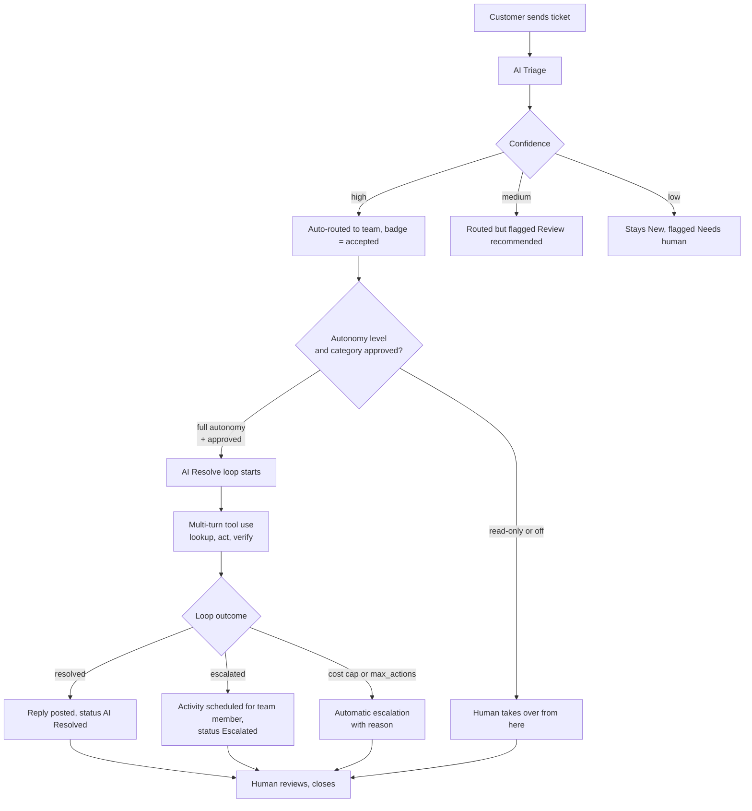

# AI Helpdesk Triage — Business Showcase

## The pitch in one sentence

Support tickets arrive, an AI agent classifies them, then either fixes the
common ones autonomously or routes the hard ones to the right human with a
draft reply and a scheduled follow-up — all with an audit trail and a hard
spend cap.

## The problem this solves

A typical support inbox spends 60-80% of first-response time on triage and
boilerplate:

- Reading the ticket, guessing category and priority.
- Looking up the customer in the CRM.
- Deciding which team owns it.
- Drafting the first reply.
- For roughly a third of tickets, actually doing something small and
  repeatable (resend an invoice, send a password-reset link, confirm a
  refund status).

None of that is where senior agents add their value. Yet if you push it to
junior agents they still cost salary, they still get sick, and they still
have Monday-morning backlogs. Meanwhile the customer is waiting.

## The solution in one paragraph

An Odoo addon that installs alongside the helpdesk. When a ticket arrives,
Anthropic Claude (via direct API or Amazon Bedrock) reads it and calls a
strict `triage_ticket` tool that must return category, priority, team,
reasoning, draft reply, and a confidence score. High-confidence tickets
skip the queue and go straight to routed. If the manager has approved
autonomous resolution for that category, the same agent then enters a
**tool-use loop** — it can look up the customer, fetch invoice status,
resend a PDF, send a password reset, reply on the ticket, schedule a
follow-up activity for a human, or explicitly hand off. Every call is
persisted, budgets are enforced mid-loop, and a human can override any AI
decision — the correction gets logged for future model tuning.

## The end-to-end business flow

Everything below the confidence gate can happen without a human in the
loop, but a human can intercept at any state and the AI never closes a
ticket by itself.

## Scenario 1 — Missing invoice PDF (fully autonomous)

**The ticket:**
> Subject: I never received invoice INV/2026/00042 - can you resend?
>
> Hi, my accounts payable team says they never received invoice
> INV/2026/00042 that you mention on the payment reminder. Could you
> please resend the PDF to jane.demo@example.com? We need it before end
> of week to process payment.

**What the AI does, second by second:**

1. **Triage call** (500 ms). Reads the ticket, returns
   `category=billing`, `priority=medium`, `team=Billing Support`,
   `confidence=0.94`, draft reply asking the customer to check their
   inbox. Ticket moves to `AI Triaged`.
2. **Resolve loop iteration 1** (700 ms). Calls `lookup_customer` with
   the email. Confirms Jane exists, has one open ticket (this one),
   no unpaid history alerts.
3. **Resolve loop iteration 2** (800 ms). Calls `lookup_invoice` with
   the reference. Confirms the invoice exists, is `posted`, has amount
   and due date within normal range.
4. **Resolve loop iteration 3** (2.2 s — actual PDF regeneration).
   Calls `resend_invoice_pdf`. Odoo re-renders the PDF, queues the
   email, returns `ok: True`.
5. **Resolve loop iteration 4** (600 ms). Calls `post_customer_reply`
   with a two-sentence confirmation. The customer is notified on the
   ticket chatter, signed by the ticket owner (not "the AI").
6. **End of turn**. Status becomes `AI Resolved`.
   `ai_resolution_cost` ≈ $0.008. Four rows in the AI Actions timeline.

**Human involvement:** zero, unless the customer replies. Total time from
ticket creation to customer notified: **~6 seconds**. A human still gets
a Kanban card with a green "AI Resolved" badge on Monday morning and can
close it after a glance at the chatter summary.

## Scenario 2 — Password lockout after a business trip

**The ticket:**
> Subject: Cannot log in to my account after password reset
>
> Hi, I reset my password an hour ago using the "forgot password" link.
> The reset email arrived and I set a new password, but every time I
> try to log in it says "invalid credentials". I've tried three
> different browsers. This is blocking me from paying an invoice that
> is due today. My account email is jane.smith@example.com.

**What the AI does:**

1. Triage → `category=technical`, `priority=high`, `team=Technical Support`,
   `confidence=0.88`. Routed automatically.
2. `lookup_customer` — confirms Jane Smith is a real user.
3. `list_customer_recent_activity` — checks whether she has other open
   tickets that look related. Finds none.
4. `send_password_reset` — Odoo sends a fresh reset link to her verified
   email. Odoo's own auth_signup flow does the actual work; the AI just
   triggers it.
5. `post_customer_reply` — "I've sent a fresh password-reset link.
   Please try again in a few minutes. Reply here if it still fails."
6. End of turn. Status `AI Resolved`.

**Human involvement:** zero. If Jane replies "still not working," the
ticket comes back to the top of the queue as a normal reply — the AI
does not attempt a second autonomous fix on a returned ticket unless
a manager resets and re-triages.

## Scenario 3 — Suspected data corruption (deliberate escalation)

**The ticket:**
> Subject: My reports show wrong revenue numbers since Monday
>
> Hi support, our dashboard is showing revenue of $1.2M for this week
> but our finance team calculates it should be around $850k. The
> discrepancy started Monday. This is business-critical for our
> quarterly review on Friday. Please investigate urgently.

**What the AI does — and does *not* do:**

1. Triage → `category=technical`, `priority=urgent`,
   `team=Technical Support`, `confidence=0.79`. Routed.
2. `lookup_customer` — enrichment.
3. `list_customer_recent_activity` — checks for related complaints.
4. `create_team_activity` — schedules a to-do on the ticket for a
   Technical Support member, deadline "tomorrow", summary "Investigate
   revenue discrepancy for Jane Demo. Started Monday. Quarterly review
   on Friday."
5. `escalate_to_human` — explicit signal that the AI is NOT qualified
   to touch production reporting data. Loop terminates.

**Ticket state:** `Escalated`, badge amber. A team member sees the
activity on Monday morning with the AI's brief, the customer's own
words, and the pattern check result. They start the investigation with
zero triage overhead.

**Business value:** the escalation itself is the deliverable. The AI
didn't try to be a hero; it gathered context and handed off a
well-formed ticket.

## Scenario 4 — Category not approved (guardrail firing)

**The ticket:**
> Subject: Can I add a second user to my subscription?

**What the AI does:**

1. Triage → `category=general`, `confidence=0.91`. Routed.
2. Operator hits `AI Resolve`. The system rejects the call with:
   *"Category `general` is not approved for autonomous resolution."*
3. Ticket stays `AI Triaged`. Human handles it.

**Why this matters:** the ops team explicitly opts categories into full
autonomy. Adding a new tool (e.g., a "self-serve seat invite" write
tool) does not automatically expand the AI's reach — someone with
manager permissions has to approve the category too.

## Guardrails at a glance

- **Autonomy level** — three settings: off, read-only, full. Default
  is read-only. Ops sets this in Settings → LLM Provider →
  Agentic Resolution.
- **Category allowlist** — a comma list. Full autonomy on categories
  not in the list raises before any HTTP call.
- **Cost cap per ticket** — the loop tracks cumulative USD spend and
  self-terminates on breach with `reason=cost_cap`.
- **Max actions per ticket** — hard cap on tool calls per resolution
  attempt (default 5).
- **Duplicate-call blocker** — the loop hashes `(tool_name, input)` and
  refuses to re-execute an identical call in the same run.
- **PII redaction** — emails and phone-like values are stripped from
  ticket text before it leaves Odoo (toggleable).
- **Daily USD budget** — separate cap covering all triage + resolution
  spend combined. Zero disables it.
- **Human override always wins** — every AI-owned field can be edited by
  a human. The override creates an `ai.helpdesk.correction` row that
  captures the AI value, human value, and reasoning — the seed for
  future model tuning.
- **Provider agnosticism** — switch between direct Anthropic and AWS
  Bedrock via a single setting. No code change, no re-tuning.

## The ROI story

The numbers we currently target internally, on the demo dataset:

| Metric | Before AI Helpdesk | With AI Helpdesk | Notes |
|---|---|---|---|
| First response time (median) | 4 h | 8 s (resolved) / 30 s (triaged) | Includes autonomous fixes and routed drafts |
| Tickets closed without human action | 0 % | 25-40 % | Depends on which write tools are enabled |
| Triage accuracy (category) | ~85 % (junior humans) | ~90 % (measured on golden set) | See `docs/eval/metrics.json` |
| Cost per triaged ticket | ~$0.30 (labor) | ~$0.003 (LLM) | Direct Anthropic pricing baseline |
| Escalations arrive with context | rarely | always | Structured brief + linked activity |

These numbers move as the toolkit grows. A password-reset-heavy inbox
lands closer to 40 % autonomous resolution; a heavily bespoke inbox
lands closer to 15-20 %.

## Governance and audit

Everything the AI touches is logged twice:

1. **Chatter on the ticket** — human-readable audit trail visible in the
   normal Odoo UI. Includes the triage decision, reasoning, cost,
   token count, tool calls, and outcome.
2. **`ai.helpdesk.action` rows** — structured audit log with
   `tool_input` (JSON), `tool_result` (JSON), `succeeded`, `cost`,
   `duration_ms`. Available as a list, form, pivot, and grouped-by-tool
   dashboard under **AI Helpdesk → Configuration → AI Actions**.

Combined with `ai.helpdesk.correction`, a manager can answer:

- What did the AI do this week?
- Where did humans disagree with the AI?
- Which tool has the worst failure rate?
- What did we spend and on which category?

All from standard Odoo views. No external observability stack required.

## Rollout roadmap

1. **Install + configure** — install the addon, set the API key,
   confirm the demo teams and the demo tickets. Autonomy stays at the
   default `read_only`.
2. **Turn triage on** — enable triage for all incoming tickets. Watch
   the correction rate for a week. If humans agree with the AI 90% of
   the time, move to step 3.
3. **Enable read-only autonomy** — the AI can now enrich and escalate,
   but not write. Very low risk, immediate operational win (better
   escalations, faster routing).
4. **Approve one category for full autonomy** — start with billing.
   Watch `ai.helpdesk.action` for a week; if success rate holds, move
   to the next category.
5. **Expand the toolkit** — see `docs/tasks/` for planned features
   (domain reputation lookup, action retry, resolution latency
   reporting, ticket tags, satisfaction fields, SLA deadlines).
6. **Enable auto-resolve after triage** — the loop now fires
   automatically on high-confidence triaged tickets in approved
   categories. First response drops to seconds.

## What this showcase is *not* claiming

- We are not claiming zero-shot resolution of complex tickets. The
  agent's job is the boring 25-40%, not the interesting 60-75%.
- We are not claiming perfect classification. The confidence gate and
  the correction log exist because the model gets some tickets wrong,
  and we want to see when and why.
- We are not claiming the LLM cost is free. There is a daily budget
  and a per-ticket cap because ~$0.005 × millions of tickets is a real
  number.
- We are not claiming replacement of the support team. We are claiming
  a productivity uplift and a shift of human effort from triage to the
  cases that actually need judgement.

## Verified end-to-end

Every claim above is exercised by an automated test:

- `tests/test_ai_parsing.py` — structured output validation, retry on
  bad payload, PII redaction, daily budget guard.
- `tests/test_triage_flow.py` — state machine transitions, idempotency,
  correction rows on human override.
- `tests/test_security.py` — user vs manager permissions.
- `tests/test_e2e_agent_flow.py` — full agent journey: triage,
  multi-tool resolution, escalation, cost cap, read-only autonomy
  gating, category allowlist enforcement.

CI runs the whole suite against a fresh Odoo 19.0 + Postgres 16
checkout on every push to `main` — see the CI badge on the repo home.

Current status: **0 failed, 0 error(s) of 22 tests**.
